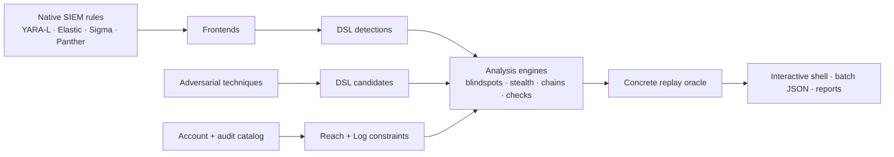

# decnique

**A Formal Language and Evaluation Framework for Measuring Detection Coverage Against
Adversarial Techniques.**

> New here (human or AI)? Start with [AGENTS.md](AGENTS.md) for a two-minute explanation,
> the architecture, the invariants, and the common traps.

> For the complete user and contributor documentation, open the [decnique wiki](docs/README.md).

decnique evaluates whether a concrete detection-rule corpus can observe adversarial actions that
are reachable in a particular cloud account and recorded in its audit logs.  It combines a shared
formal language with native-rule translators, a GCP account and audit catalog, symbolic analysis,
concrete replay, and an interactive and batch-capable shell.

The DSL is the common representation, not the whole product.  Google SecOps/YARA-L, Elastic,
Sigma, and Panther rules are translated into it; attacker techniques use the same event and trace
model.  The evaluation engines can then compare both sides while accounting for what principals
can do, what GCP logs, and what each rule observes.

## What it answers

- **Blindspots** — for a permission, does any reachable and logged action evade every loaded
  detection?  A finding includes a concrete event witness.
- **Stealth** — can a particular adversarial technique, including a specific payload and
  multi-event footprint, execute without any rule firing?
- **Chains** — can individually stealthy techniques be composed into a privilege-escalation path?
- **Checks** — do named coverage, boundary, redundancy, dead-rule, comparison, and public-access
  assertions pass, fail, or remain unknown?

The core single-event question is:

```text
∃ e : Reach_p(e) ∧ Log(e) ∧ ¬(⋁_R Observes(R, e))
```

Every answer is three-valued—yes, no, or don't-know—and every symbolic witness is replayed through
the concrete evaluator before it is reported.

## How the pieces fit



The coverage engine uses a finite **atom abstraction** of the string tests made by the loaded
rules.  The solver proposes models; account reachability, audit logging, and the concrete rule
oracle decide whether a proposed witness is valid.

## Layout

```
decnique/
  dsl/          grammar, parser, AST, formatter, interpreter, and loader
  model/        shared event vocabulary, predicates, and trace specifications
  frontends/    Google SecOps/YARA-L, Elastic, Sigma, and Panther → DSL
  env/          account model, GCP/gcloud/Terraform import, Reach and Log
  catalogs/     GCP methods, permissions, roles, tags, and UDM field mappings
  eval/         concrete trace evaluator—the replay oracle
  smt/          atom abstraction, blindspot analysis, and stealth analysis
  graph/        stealthy privilege-escalation chain search
  ui/           interactive shell, batch mode, rendering, configuration, and reports
  checks.py     engines for named DSL checks
  answers.py    JSON-serializable blindspot, stealth, and chain reports
examples/       accounts, candidates, checks, events, and Terraform inputs
tests/          unit, property, end-to-end, and optional real-corpus tests
run.py          interactive and one-shot shell launcher
```

## The formal language

The shared language has four top-level constructs:

- **detection** — a pattern in the logs that should raise an alarm (single- or
multi-event, with joins, windows, ordering, aggregates, and count conditions).
- **candidate** — the mirror image: what an attacker *needs* (`required`) and the
trace they *leave* (`footprint`, with `repeat`/`within`/`distinct`).
- **check** — a saved question (e.g. a boundary assertion).
- **ruleset** — a bundle of includes with enable/disable toggles.

Both a detection and a candidate bottom out in the same event form, which is what
makes them directly comparable.  Native SIEM rules are translated into these structures, so users
can work with their existing rule corpus instead of rewriting it by hand.

## Install & use

With `uv`, create the project environment and install the runtime package:

```bash
uv venv
uv pip install -e .
```

The commands below use `uv run`, so activating `.venv` is not required.  Request the `dev` extra
when running the test suite or development tools:

```bash
uv run --extra dev python -m pytest                       # ~35 s
uv run --extra dev python -m pytest -m "not e2e"         # ~20 s; see CONTRIBUTING.md
```

Alternatively, activate the environment with `source .venv/bin/activate`, install
`uv pip install -e ".[dev]"`, and omit `uv run` from the commands.

## Run the shell

From the repository root:

```bash
uv run python run.py
```

This opens the interactive shell.  Type `help` to list its objects and verbs.  A minimal analysis
session looks like this (the optional IAMouflage setup is described below):

```text
rules load ../IAMouflage/data/detections
candidates load examples/candidates/candidates.decn
checks load examples/checks/checks.decn
account load examples/accounts/custom/account.json
rules summary
ask blindspots resourcemanager.projects.setIamPolicy
ask stealth escalate_project_iam
ask chains
ask check
```

Commands follow `<object> <verb> [args…]`.  The shell keeps the loaded rules, techniques, account,
events, and reports in one session; the solver runs only for commands under `ask`.  Exit with
`quit` or `Ctrl-D`.

### Optional real-rule corpus

The repository does not vendor third-party SIEM rules.  The optional corpus tests use the four
version-pinned rule repositories collected by
[IAMouflage](https://github.com/moabid42/IAMouflage). Clone it next to this repository with its
Git submodules:

```bash
git clone --recurse-submodules https://github.com/moabid42/IAMouflage.git ../IAMouflage
uv run --extra dev python -m pytest -q -m corpus
```

That sibling location is discovered automatically.  If you clone it elsewhere, point the tests
at its detection directory:

```bash
export DECNIQUE_CORPUS=/absolute/path/to/IAMouflage/data/detections
uv run --extra dev python -m pytest -q -m corpus
```

`DECNIQUE_CORPUS` is only test discovery.  To analyze those rules, load them explicitly:

```text
rules load ../IAMouflage/data/detections
```

The IAMouflage Docker/Neo4j pipeline is not needed; decnique reads the native rule files directly.

## As a Python library

```python
from decnique import parse_text, format_bundle, DetectionLibrary, event_from_audit_log

bundle = parse_text(open("rules.decn").read(), "rules.decn")
print(format_bundle(bundle))                       # canonical text; parse(format(x)) == x

lib = DetectionLibrary(bundle)
ev  = event_from_audit_log(one_cloud_audit_log_json)
obs = lib.observing(ev)      # Observes(R, e): which rules fire, which are "unknown"
```

## Batch mode

The same workflow can run non-interactively in CI, with stable exit codes and optional JSON or
saved reports:

```bash
uv run python run.py \
  --rules ../IAMouflage/data/detections \
  --account examples/accounts/custom/account.json \
  --json --fail-on finding \
  ask blindspots resourcemanager.projects.setIamPolicy
```

Accounts can come from decnique JSON, raw `gcloud` IAM exports, or Terraform state, plan, and
`*.tf.json` configuration.

## Honesty and soundness

Anything the language cannot express becomes a first-class `unknown("label")` atom;
the rule is flagged `approximate` and the interpreter answers three-valued —
**yes / no / don't know** — never forcing a false yes or no.  Solver-generated witnesses are
accepted only after concrete replay confirms reachability, logging, and non-observation by the
loaded rules.

## Roadmap / future work

`CHANGELOG.md` records what has already landed. This is what is next, grouped by theme.

**Coverage as a measure** — turn the binary covered / not-covered verdict into a quantity.

- [ ] **Holes as regions, not single witnesses.**  
Return the whole evading set over a technique's free variables
(e.g. `window ∈ [600,899] ∧ method=PATCH`), not just one example event.
- [ ] **Cost-weighted coverage measure.**  
Measure the safe region (volume for numeric axes, integer-point count for discrete ones),
weighted by attacker cost, reported as a number with an uncertainty band. This *is* the
severity ranking of gaps — the smallest, cheapest-to-reach holes rank first.
- [ ] **Escape distances / brittleness.**  
For an action a rule *does* catch, how small a change on each axis slips it out of every rule —
surfacing rules that catch something only by a hair.

**Shrink the translation residue** — every `unknown` is a real detection the tool steps around.

- [ ] **Function-derived, relational, and aggregate rules.**  
After the parser fixes, ~42 of 922 SecOps corpus rules are still approximate (2 of 27 once
filtered to GCP). What remains: values computed from a field (`re.capture`, `re.replace`,
`strings.concat`, `base64_decode`), field-vs-field comparisons (`$e.a = $e.b`), and
group aggregates (`count_distinct`). Add model support (keep the real value only for the
fields that need it) to close them, keeping the `unknown` honesty for what still cannot fit.
- [ ] **Reference lists as data.**  
Let the user load `%list` contents (watchlists, allow-lists) via config, so `field in %list`
becomes an exact membership test instead of `unknown`.
- [ ] **Evaluate IAM Conditions.**  
A conditional binding is currently kept *unconditionally*, so reachability is
over-approximated (it may report a gap a time/tag/IP condition would actually block). Parse
and evaluate the condition so `Reach` is exact.
- [x] **A richer technique library.**  
Wired-together GCP techniques for `ask chains` / `ask stealth`, plus replayable event traces
(`examples/candidates/candidates_medium.decn`, `examples/candidates/candidates_advanced.decn`,
`examples/events/events.json`).

**Grounding & scale**

- [ ] **Loop back to real logs.**  
Ingest actual audit-log samples to check the tool's own assumptions, and confirm an exported
"gap" event truly stays silent in a real SIEM — turning *we believe this is a gap* into
*we watched it go uncaught*.
- [ ] **Faster whole-account audits.**  
Cache each method's solver domain across permissions that share methods, so an owner-level
`ask blindspots` scan drops well under its current ~10–20 min.

**Stretch (beyond the thesis)**

- [ ] **A second cloud.**  
Everything is GCP IAM today; a new catalog + account importer + front-end idioms would open
the same questions for AWS or Azure.
