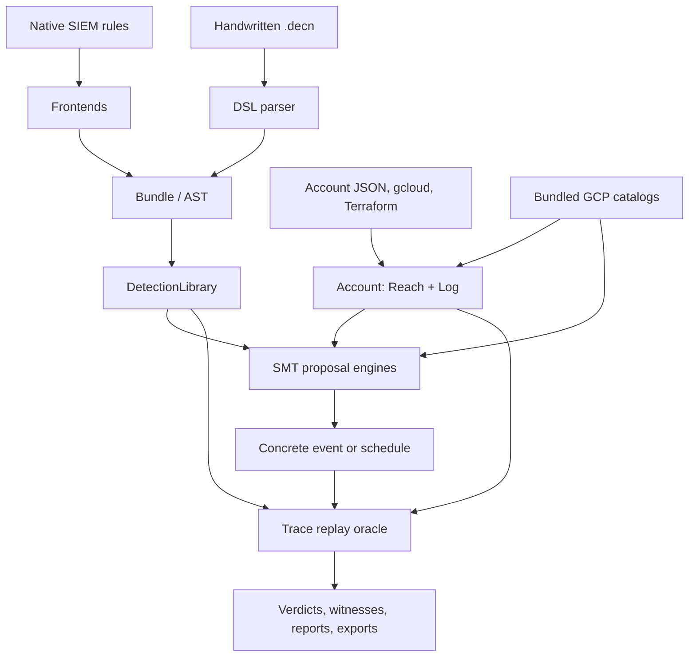

# Architecture

decnique separates translation, environment modeling, symbolic proposal, and concrete judgment.
That separation is the central safety property of the implementation.

## End-to-end data flow



The same predicate and trace types are used by handwritten DSL and every native frontend. No
frontend has a private evaluation path after translation.

## Layer map

| Layer | Modules | Responsibility |
|---|---|---|
| Language | `decnique/dsl/*` | Grammar, parser, immutable AST, canonical formatter, YAML/JSON serialization, loading, concrete leaf interpretation |
| Shared model | `decnique/model/*` | Closed event vocabulary, predicate tree, correlation/aggregate trace model |
| Translation | `decnique/frontends/*` | Native rule syntax to shared detection AST with explicit unknowns |
| Environment | `decnique/env/*`, `decnique/catalogs/*` | Account reachability, logging, imports, methods/permissions/roles/UDM facts |
| Concrete evaluation | `decnique/eval/trace_eval.py`, `decnique/detections.py` | Event observation, trace firing, candidate footprint matching |
| Symbolic analysis | `decnique/smt/*` | Event/trace encodings, atom abstraction, realization, blindspots, stealth |
| Graph analysis | `decnique/graph/*` | Privilege states, technique effects, shortest stealthy paths |
| Saved assertions | `decnique/checks.py` | Check-type dispatch and pass/fail/unknown evidence |
| API reports | `decnique/answers.py` | JSON-serializable blindspot, stealth, chain, and full reports |
| Operator UI | `decnique/ui/*`, `run.py` | Session, command registry, REPL/batch dispatch, rendering, browse, config, reports |
| Tooling CLI | `decnique/cli.py` | Parse/format/import/load/event/trace/coverage compatibility commands |

## Language representation

The parser produces a `Bundle` of frozen dataclasses:

- `Detection(id, TraceSpec, meta, source)`;
- `Candidate(id, required, footprint, actor, context, share, gains)`;
- `Check(id, type, params)`;
- `Ruleset(id, includes, disabled, enabled)`;
- accumulated `LoadIssue` records.

Predicates are trees of comparisons, string/glob/regex/network/list tests, presence, constants,
unknowns, negation, conjunction, and disjunction. Every field is a `(variable, path)` pair. Trace
specifications add event variables, joins, grouping, a window, order, aggregate expressions, a
condition, and options.

The formatter works from this AST and is canonical. YAML/JSON serialization tags node types so
every variant—including unknown atoms—survives a round trip.

## Concrete three-valued oracle

`dsl.interpret.evaluate` handles one predicate on one event. Missing normal fields are false for a
complete event; missing fields are unknown only during partial `admits` evaluation. An explicit
unknown atom or absent reference list returns `None`. Boolean composition follows three-valued
logic.

`eval.trace_eval.fires` is the final rule oracle:

1. Match each concrete event against every event variable.
2. Build correlation groups from join-connected and group-by fields.
3. Apply overall or anchored windows.
4. Apply event-variable order.
5. Compute count and numeric aggregate intervals that preserve possible/definite matches.
6. Evaluate the condition and return true, false, or unknown across groups.

`matches_footprint` is the candidate-side oracle. It verifies method and `where`, repetition,
distinct values, per-step intervals, order, and total span.

Rules that fire on an empty trace are treated as vacuous for coverage/stealth replay; otherwise an
upper-bound condition such as `#e < 5` would incorrectly “cover” every unrelated action.

## Account and catalog model

`Account.reach` indexes exact and wildcard permission grants per principal. It checks resource
scope against the target and its ancestors, then applies deny overrides. `Account.logged` combines
method classification with Admin Activity, per-service Data Access configuration, and disabled
methods.

The catalog bridges the account's permission world and the rule's method world. `MethodInfo`
contains permissions, service, log class, product name, verification/source, and confidence.
Catalog field invariants prevent impossible witness combinations such as a known method paired
with the wrong service/product.

The session attests generated method names when loaded rules test those names literally. Loading
rules before or after the account is safe because attestation runs after both operations.

## Single-event coverage abstraction

String theory is avoided. Instead, every atomic string test made by rules becomes a Boolean `Atom`:

```text
(field, kind, literal, nocase)
```

Kinds include equality, contains, starts-with, ends-with, glob, and regex. Integers, booleans, IPs,
time, and field presence retain native symbolic sorts.

`CoverageContext` is built once per detection library:

- encode each rule that can fire on one event;
- guard each negated observation formula with a rule assumption literal;
- maintain incremental equality-group consistency;
- add soft preferences for absent optional fields and false atoms, yielding small witnesses;
- cache method-dependent atom determinations across permission probes.

For one permission, `find_gap` pushes a domain of methods, principals, permission, resource reach,
logging, grant decision, and catalog invariants. If SAT, `Realizer` constructs actual strings and
checks every atom using the concrete interpreter.

When realization fails, it may learn only logically proven clauses: equality implications,
substring implications, and mutually exclusive prefixes/suffixes. If no proven explanation exists,
the exact model is blocked but the search records that the block was unproven. Consequently, a
later UNSAT becomes `exhausted`, not a coverage proof.

The realized event is replayed through account reach/logging and every non-vacuous rule. A caught
proposal is blocked. A returned gap has therefore crossed the concrete trust boundary.

`legacy_coverage.py` keeps the older string-theory implementation only for differential tests; it
is not the product engine. `bucket.py` offers optional grouping of permissions with identical
coverage signatures.

## Symbolic stealth

Stealth expands a candidate footprint into one symbolic event occurrence per required repetition.
It adds exact footprint constraints and exact evasion constraints for a tractable rate-rule class.
Rules outside that class are not assumed away; they are checked during replay.

The solver proposes times and event values. The schedule decoder includes every closed vocabulary
field, every field used by the candidate/rules, and catalog-required fields. The candidate oracle
must confirm the footprint, and the rule oracle must find no definite firing. Unknown rule results
mark the returned schedule approximate.

If exact rate-rule evasion is UNSAT before any unproven footprint block, `AlwaysDetected` is a valid
proof over that encoded class and its assumption core identifies catching rules.

## Chain search

Graph state is a frozen set of permissions. A `Technique` edge requires all candidate permissions
and unions its declared gains. Breadth-first search explores each state once.

Standalone evasiveness is necessary but insufficient. `_path_replay` concatenates prior hop
schedules and the next schedule, filters unlogged events, and evaluates the full rule library. It
tries zero delay and a patient-attacker delay beyond the largest rule window. Only a replay-clean
edge enters the queue.

This design catches correlations spanning techniques while keeping the state space finite. The
negative result is scoped to the schedules and delays attempted, as described in the
[Analysis guide](analysis-guide.md#chains-search-privilege-transitions).

## Check engines

Checks reuse one `CoverageContext` across a batch where possible. Most reduce to one of three
operations:

- `find_gap` under extra constraints;
- `stealth_feasible` for one candidate;
- set-difference satisfiability between encoded single-event rules.

Every existential event witness is realized/replayed. Approximate inputs prevent a clean proof when
they matter. A syntactically valid but unsupported mode returns unknown instead of raising or
guessing.

## UI and reporting architecture

`ui.commands.OBJECTS` is the single source for dispatch, help, and completion. Every `Verb` stores
its argument hint, one-line help, detailed help, path-completion flag, and settings prefix.

`Session` owns mutable state. Loading is additive; same-ID definitions in a later load replace old
ones. Event traces are replaced on load and de-duplicated by normalized JSON. Errors in interactive
commands are caught so the session survives; `DECNIQUE_DEBUG=1` re-raises unexpected exceptions.

Solver verbs use `with session.report(...)` and append structured items. The report layer saves
Markdown, JSON, or YAML; Markdown embeds JSON to support reopening. Batch mode reads the same report
to implement JSON output and exit policies.

## Five implementation invariants

1. **Translation honesty:** untranslatable meaning becomes unknown, never true or false.
2. **Replay soundness:** a model is a proposal; concrete reach, logging, footprint, and rule firing
   decide whether it is evidence.
3. **Catalog realism:** known method facts constrain generated events; unverified names cannot be
   the sole basis of an exact gap.
4. **Witness shape:** raw UDM and tag values are nested where the oracle reads them.
5. **Language stability:** canonical formatting reparses to the same AST.

These are not stylistic preferences. Each prevents a specific class of false security claim.
